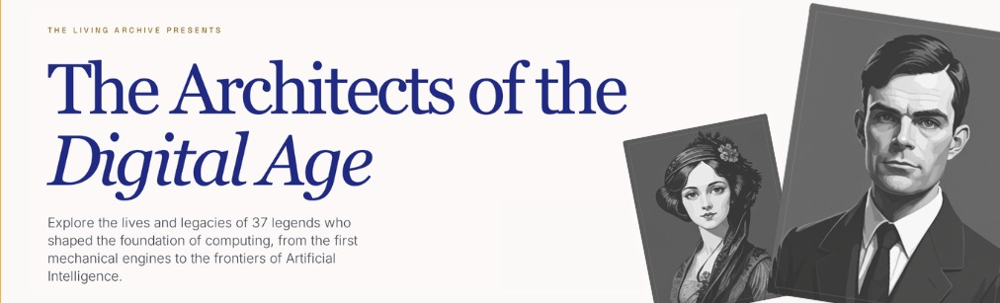

# Greatest Computer Scientists

> ⭐ If this collection taught you something, helped with a lesson, or sent you down a fun rabbit hole, please star the repo and share it.

A curated collection of **37 computing legends** whose ideas still shape the way we build software, train AI, design networks, and understand computation itself.

## At a Glance

- **What this is:** A visual, browsable collection of biographies covering computing pioneers, programming language creators, AI founders, and internet architects.
- **Why it is useful:** Every profile links historical impact to modern relevance — from Google Maps and TCP/IP to Python and deep learning.
- **Why people bookmark it:** Portraits, concise summaries, quotes, and further-reading links make it useful for learning, teaching, and sharing.

## Website SEO

- **Live site:** The collection website is deployed from the `website` branch to GitHub Pages.
- **SEO system:** Route metadata, structured data, social previews, sitemap generation, and `robots.txt` are maintained inside `site/`.
- **Upgrade guide:** See `site/docs/SEO_PROCESS.md` for the full SEO workflow, file map, validation steps, and future upgrade checklist.

## Did You Know?

- **Ada Lovelace:** Wrote an algorithm for a machine roughly a century before a programmable computer existed to run it.
- **Margaret Hamilton:** Built Apollo flight software that prioritized critical tasks during the moon landing and helped prevent an abort.
- **John Kemeny and Thomas Kurtz:** Designed BASIC so students outside science and engineering could learn programming in an afternoon.
- **Edsger Dijkstra:** Wrote the shortest-path algorithm that still powers route planning, network routing, and graph systems everywhere.
- **Radia Perlman:** Invented Spanning Tree Protocol — one of the quiet reasons Ethernet networks do not melt into endless loops.
- **Guido van Rossum:** Started Python as a holiday side project; it went on to dominate AI, automation, and data science.
- **Tim Berners-Lee:** Gave the World Wide Web away royalty-free, which is a big reason the web became universal.

## Organization

This repository is organized by domain and era:

- **[pioneers/](pioneers/)** - Pre-1950 visionaries who conceived computing before electronics
- **[foundational-cs/](foundational-cs/)** - 1950s-1970s theorists who established CS foundations
- **[systems-languages/](systems-languages/)** - Creators of operating systems and programming languages
- **[ai-pioneers/](ai-pioneers/)** - 1950s-1980s founders of artificial intelligence
- **[modern-ai-ml/](modern-ai-ml/)** - Deep learning revolution and modern AI
- **[web-internet/](web-internet/)** - Inventors of internet protocols and the Web

## Complete List

**Legend:** `🏆` = ACM Turing Award winner. Portraits have their own column, names are stacked for readability, and click any name to open the full profile.

### Pioneers (Pre-1950)

<table>
	<thead>
		<tr>
			<th>Portrait</th>
			<th>Name</th>
			<th>Award</th>
			<th>Lifespan</th>
			<th>Key Contribution</th>
			<th>Field</th>
			<th>Why it matters today</th>
		</tr>
	</thead>
	<tbody>
		<tr>
			<td align="center"></td>
			<td><a href="pioneers/charles-babbage/"><strong>Charles</strong> <strong>Babbage</strong></a></td>
			<td align="center">—</td>
			<td>1791-1871</td>
			<td>Analytical Engine design</td>
			<td>Mechanical Computing</td>
			<td>The idea of a programmable general-purpose machine starts with his architecture.</td>
		</tr>
		<tr>
			<td align="center"></td>
			<td><a href="pioneers/ada-lovelace/"><strong>Ada</strong> <strong>Lovelace</strong></a></td>
			<td align="center">—</td>
			<td>1815-1852</td>
			<td>First algorithm</td>
			<td>Programming, Mathematics</td>
			<td>Her insight that software can manipulate symbols foreshadows modern creative computing and AI.</td>
		</tr>
		<tr>
			<td align="center"></td>
			<td><a href="pioneers/george-boole/"><strong>George</strong> <strong>Boole</strong></a></td>
			<td align="center">—</td>
			<td>1815-1864</td>
			<td>Boolean algebra</td>
			<td>Mathematics, Logic</td>
			<td>Boolean logic is baked into every CPU, database filter, and search query.</td>
		</tr>
		<tr>
			<td align="center"></td>
			<td><a href="pioneers/herman-hollerith/"><strong>Herman</strong> <strong>Hollerith</strong></a></td>
			<td align="center">—</td>
			<td>1860-1929</td>
			<td>Punch card tabulating machines</td>
			<td>Data Processing</td>
			<td>Large-scale data processing and business computing start with his tabulators.</td>
		</tr>
		<tr>
			<td align="center"></td>
			<td><a href="pioneers/konrad-zuse/"><strong>Konrad</strong> <strong>Zuse</strong></a></td>
			<td align="center">—</td>
			<td>1910-1995</td>
			<td>Z3, first programmable computer</td>
			<td>Computer Hardware</td>
			<td>His Z3 and Plankalkül anticipate programmable machines and higher-level languages.</td>
		</tr>
	</tbody>
</table>

### Foundational Computer Science (1950s-1970s)

<table>
	<thead>
		<tr>
			<th>Portrait</th>
			<th>Name</th>
			<th>Award</th>
			<th>Lifespan</th>
			<th>Key Contribution</th>
			<th>Field</th>
			<th>Why it matters today</th>
		</tr>
	</thead>
	<tbody>
		<tr>
			<td align="center"></td>
			<td><a href="foundational-cs/alan-turing/"><strong>Alan</strong> <strong>Turing</strong></a></td>
			<td align="center">—</td>
			<td>1912-1954</td>
			<td>Turing machine, computability</td>
			<td>Theoretical CS, AI</td>
			<td>Computability, codebreaking, and AI evaluation still orbit Turing's ideas.</td>
		</tr>
		<tr>
			<td align="center"></td>
			<td><a href="foundational-cs/john-von-neumann/"><strong>John von</strong> <strong>Neumann</strong></a></td>
			<td align="center">—</td>
			<td>1903-1957</td>
			<td>Von Neumann architecture</td>
			<td>Computer Architecture</td>
			<td>Nearly every laptop, phone, and cloud server still follows his stored-program model.</td>
		</tr>
		<tr>
			<td align="center"></td>
			<td><a href="foundational-cs/claude-shannon/"><strong>Claude</strong> <strong>Shannon</strong></a></td>
			<td align="center">—</td>
			<td>1916-2001</td>
			<td>Information theory</td>
			<td>Information Theory</td>
			<td>Compression, cryptography, and digital communication all sit on Shannon's theory.</td>
		</tr>
		<tr>
			<td align="center"></td>
			<td><a href="foundational-cs/grace-hopper/"><strong>Grace</strong> <strong>Hopper</strong></a></td>
			<td align="center">—</td>
			<td>1906-1992</td>
			<td>First compilers, COBOL</td>
			<td>Programming Languages</td>
			<td>Compilers and readable languages remain central to developer productivity.</td>
		</tr>
		<tr>
			<td align="center"></td>
			<td><a href="foundational-cs/donald-knuth/"><strong>Donald</strong> <strong>Knuth</strong></a></td>
			<td align="center">🏆</td>
			<td>b. 1938</td>
			<td><em>TAOCP</em>, TeX</td>
			<td>Algorithms, Typesetting</td>
			<td>Algorithm analysis and TeX still shape software engineering and scientific publishing.</td>
		</tr>
		<tr>
			<td align="center"></td>
			<td><a href="foundational-cs/edsger-dijkstra/"><strong>Edsger</strong> <strong>Dijkstra</strong></a></td>
			<td align="center">🏆</td>
			<td>1930-2002</td>
			<td>Dijkstra's algorithm</td>
			<td>Algorithms</td>
			<td>Shortest-path routing powers maps, networks, and infrastructure software every day.</td>
		</tr>
		<tr>
			<td align="center"></td>
			<td><a href="foundational-cs/tony-hoare/"><strong>Tony</strong> <strong>Hoare</strong></a></td>
			<td align="center">🏆</td>
			<td>b. 1934</td>
			<td>Quicksort, Hoare logic</td>
			<td>Algorithms, Formal Methods</td>
			<td>Quicksort and formal verification still underpin performant and reliable software.</td>
		</tr>
	</tbody>
</table>

### Systems & Languages

<table>
	<thead>
		<tr>
			<th>Portrait</th>
			<th>Name</th>
			<th>Award</th>
			<th>Lifespan</th>
			<th>Key Contribution</th>
			<th>Field</th>
			<th>Why it matters today</th>
		</tr>
	</thead>
	<tbody>
		<tr>
			<td align="center"></td>
			<td><a href="systems-languages/john-kemeny/"><strong>John G.</strong> <strong>Kemeny</strong></a></td>
			<td align="center">—</td>
			<td>1926-1992</td>
			<td>BASIC, time-sharing</td>
			<td>Programming Languages</td>
			<td>Beginner-friendly programming and campus-wide access foreshadow coding education platforms.</td>
		</tr>
		<tr>
			<td align="center"></td>
			<td><a href="systems-languages/thomas-kurtz/"><strong>Thomas E.</strong> <strong>Kurtz</strong></a></td>
			<td align="center">—</td>
			<td>b. 1928</td>
			<td>BASIC, time-sharing</td>
			<td>Programming Languages</td>
			<td>Shared computing for students prefigured modern cloud labs and edtech.</td>
		</tr>
		<tr>
			<td align="center"></td>
			<td><a href="systems-languages/margaret-hamilton/"><strong>Margaret</strong> <strong>Hamilton</strong></a></td>
			<td align="center">—</td>
			<td>b. 1936</td>
			<td>Apollo software, "software engineering"</td>
			<td>Software Engineering</td>
			<td>Fault-tolerant software design remains essential in aerospace and safety-critical systems.</td>
		</tr>
		<tr>
			<td align="center"></td>
			<td><a href="systems-languages/dennis-ritchie/"><strong>Dennis</strong> <strong>Ritchie</strong></a></td>
			<td align="center">🏆</td>
			<td>1941-2011</td>
			<td>C language, Unix</td>
			<td>Operating Systems</td>
			<td>C and Unix still shape operating systems, compilers, and low-level tooling.</td>
		</tr>
		<tr>
			<td align="center"></td>
			<td><a href="systems-languages/ken-thompson/"><strong>Ken</strong> <strong>Thompson</strong></a></td>
			<td align="center">🏆</td>
			<td>b. 1943</td>
			<td>Unix, C</td>
			<td>Operating Systems</td>
			<td>Unix, UTF-8, and Go influence everything from servers to modern developer workflows.</td>
		</tr>
		<tr>
			<td align="center"></td>
			<td><a href="systems-languages/frances-allen/"><strong>Frances</strong> <strong>Allen</strong></a></td>
			<td align="center">🏆</td>
			<td>1932-2020</td>
			<td>Compiler optimization</td>
			<td>Compiler Theory</td>
			<td>Compiler optimizations still unlock performance on CPUs, GPUs, and AI workloads.</td>
		</tr>
		<tr>
			<td align="center"></td>
			<td><a href="systems-languages/barbara-liskov/"><strong>Barbara</strong> <strong>Liskov</strong></a></td>
			<td align="center">🏆</td>
			<td>b. 1939</td>
			<td>Data abstraction</td>
			<td>Programming Languages</td>
			<td>LSP and data abstraction still guide APIs, OOP, and distributed systems.</td>
		</tr>
		<tr>
			<td align="center"></td>
			<td><a href="systems-languages/bjarne-stroustrup/"><strong>Bjarne</strong> <strong>Stroustrup</strong></a></td>
			<td align="center">—</td>
			<td>b. 1950</td>
			<td>C++</td>
			<td>Programming Languages</td>
			<td>C++ still powers browsers, trading systems, game engines, and embedded devices.</td>
		</tr>
		<tr>
			<td align="center"></td>
			<td><a href="systems-languages/james-gosling/"><strong>James</strong> <strong>Gosling</strong></a></td>
			<td align="center">—</td>
			<td>b. 1955</td>
			<td>Java</td>
			<td>Programming Languages</td>
			<td>Java and the JVM remain core to enterprise systems, Android, and large-scale backends.</td>
		</tr>
		<tr>
			<td align="center"></td>
			<td><a href="systems-languages/guido-van-rossum/"><strong>Guido van</strong> <strong>Rossum</strong></a></td>
			<td align="center">—</td>
			<td>b. 1956</td>
			<td>Python</td>
			<td>Programming Languages</td>
			<td>Python is the lingua franca of AI, automation, data science, and teaching.</td>
		</tr>
		<tr>
			<td align="center"></td>
			<td><a href="systems-languages/brendan-eich/"><strong>Brendan</strong> <strong>Eich</strong></a></td>
			<td align="center">—</td>
			<td>b. 1961</td>
			<td>JavaScript</td>
			<td>Web Technologies</td>
			<td>JavaScript still runs the interactive web in every browser on Earth.</td>
		</tr>
		<tr>
			<td align="center"></td>
			<td><a href="systems-languages/linus-torvalds/"><strong>Linus</strong> <strong>Torvalds</strong></a></td>
			<td align="center">—</td>
			<td>b. 1969</td>
			<td>Linux kernel, Git</td>
			<td>Operating Systems</td>
			<td>Linux and Git are foundational infrastructure for cloud, mobile, and open source.</td>
		</tr>
	</tbody>
</table>

### AI Pioneers (1950s-1980s)

<table>
	<thead>
		<tr>
			<th>Portrait</th>
			<th>Name</th>
			<th>Award</th>
			<th>Lifespan</th>
			<th>Key Contribution</th>
			<th>Field</th>
			<th>Why it matters today</th>
		</tr>
	</thead>
	<tbody>
		<tr>
			<td align="center"></td>
			<td><a href="ai-pioneers/john-mccarthy/"><strong>John</strong> <strong>McCarthy</strong></a></td>
			<td align="center">🏆</td>
			<td>1927-2011</td>
			<td>Coined "AI", Lisp</td>
			<td>Artificial Intelligence</td>
			<td>AI as a field, Lisp, and symbolic reasoning still shape research and tooling.</td>
		</tr>
		<tr>
			<td align="center"></td>
			<td><a href="ai-pioneers/marvin-minsky/"><strong>Marvin</strong> <strong>Minsky</strong></a></td>
			<td align="center">🏆</td>
			<td>1927-2016</td>
			<td>AI Lab, perceptrons</td>
			<td>Artificial Intelligence</td>
			<td>His ideas on minds, perception, and AI still influence robotics and AGI debates.</td>
		</tr>
		<tr>
			<td align="center"></td>
			<td><a href="ai-pioneers/allen-newell/"><strong>Allen</strong> <strong>Newell</strong></a></td>
			<td align="center">🏆</td>
			<td>1927-1992</td>
			<td>Logic Theorist</td>
			<td>AI, Cognitive Psychology</td>
			<td>Problem-solving architectures and human-computer modeling still inform AI system design.</td>
		</tr>
		<tr>
			<td align="center"></td>
			<td><a href="ai-pioneers/herbert-simon/"><strong>Herbert</strong> <strong>Simon</strong></a></td>
			<td align="center">🏆</td>
			<td>1916-2001</td>
			<td>Logic Theorist</td>
			<td>AI, Cognitive Psychology</td>
			<td>Bounded rationality still shapes product design, behavioral science, and decision AI.</td>
		</tr>
	</tbody>
</table>

### Modern AI & Machine Learning

<table>
	<thead>
		<tr>
			<th>Portrait</th>
			<th>Name</th>
			<th>Award</th>
			<th>Lifespan</th>
			<th>Key Contribution</th>
			<th>Field</th>
			<th>Why it matters today</th>
		</tr>
	</thead>
	<tbody>
		<tr>
			<td align="center"></td>
			<td><a href="modern-ai-ml/judea-pearl/"><strong>Judea</strong> <strong>Pearl</strong></a></td>
			<td align="center">🏆</td>
			<td>b. 1936</td>
			<td>Bayesian networks, causality</td>
			<td>AI, Probabilistic Reasoning</td>
			<td>Causality and Bayesian reasoning are central to trustworthy, explainable AI.</td>
		</tr>
		<tr>
			<td align="center"></td>
			<td><a href="modern-ai-ml/geoffrey-hinton/"><strong>Geoffrey</strong> <strong>Hinton</strong></a></td>
			<td align="center">🏆</td>
			<td>b. 1947</td>
			<td>Backpropagation</td>
			<td>Deep Learning</td>
			<td>Deep learning breakthroughs now power speech, vision, and generative AI.</td>
		</tr>
		<tr>
			<td align="center"></td>
			<td><a href="modern-ai-ml/yann-lecun/"><strong>Yann</strong> <strong>LeCun</strong></a></td>
			<td align="center">🏆</td>
			<td>b. 1960</td>
			<td>Convolutional neural networks</td>
			<td>Computer Vision, Deep Learning</td>
			<td>CNNs made modern computer vision practical, from phones to self-driving research.</td>
		</tr>
		<tr>
			<td align="center"></td>
			<td><a href="modern-ai-ml/yoshua-bengio/"><strong>Yoshua</strong> <strong>Bengio</strong></a></td>
			<td align="center">🏆</td>
			<td>b. 1964</td>
			<td>Deep learning, sequences</td>
			<td>Machine Learning</td>
			<td>Representation learning and generative modeling drive today's AI progress.</td>
		</tr>
		<tr>
			<td align="center"></td>
			<td><a href="modern-ai-ml/andrew-ng/"><strong>Andrew</strong> <strong>Ng</strong></a></td>
			<td align="center">—</td>
			<td>b. 1976</td>
			<td>Google Brain, AI education</td>
			<td>Machine Learning</td>
			<td>He helped turn machine learning into a practical skill for millions of engineers.</td>
		</tr>
	</tbody>
</table>

### Web & Internet

<table>
	<thead>
		<tr>
			<th>Portrait</th>
			<th>Name</th>
			<th>Award</th>
			<th>Lifespan</th>
			<th>Key Contribution</th>
			<th>Field</th>
			<th>Why it matters today</th>
		</tr>
	</thead>
	<tbody>
		<tr>
			<td align="center"></td>
			<td><a href="web-internet/bob-kahn/"><strong>Bob</strong> <strong>Kahn</strong></a></td>
			<td align="center">🏆</td>
			<td>b. 1938</td>
			<td>TCP/IP</td>
			<td>Computer Networks</td>
			<td>TCP/IP's open architecture lets billions of devices communicate across the internet.</td>
		</tr>
		<tr>
			<td align="center"></td>
			<td><a href="web-internet/vint-cerf/"><strong>Vint</strong> <strong>Cerf</strong></a></td>
			<td align="center">🏆</td>
			<td>b. 1943</td>
			<td>TCP/IP</td>
			<td>Computer Networks</td>
			<td>The internet still runs on the protocols he co-designed.</td>
		</tr>
		<tr>
			<td align="center"></td>
			<td><a href="web-internet/radia-perlman/"><strong>Radia</strong> <strong>Perlman</strong></a></td>
			<td align="center">—</td>
			<td>b. 1951</td>
			<td>Spanning Tree Protocol</td>
			<td>Computer Networks</td>
			<td>Spanning Tree Protocol still keeps Ethernet networks loop-free and stable.</td>
		</tr>
		<tr>
			<td align="center"></td>
			<td><a href="web-internet/tim-berners-lee/"><strong>Tim</strong> <strong>Berners-Lee</strong></a></td>
			<td align="center">🏆</td>
			<td>b. 1955</td>
			<td>World Wide Web</td>
			<td>Web Technologies</td>
			<td>Open web standards still keep the web interoperable, linkable, and universal.</td>
		</tr>
	</tbody>
</table>

## Contributing

Suggestions and improvements are welcome.

- Open an issue or pull request
- Keep entries factual and cite reputable sources when adding new claims
- Prefer concise summaries of contributions and impact

## License

This repository uses the MIT license; see [`LICENSE`](LICENSE).

Portraits with separate attribution or reuse requirements are documented in [`PORTRAIT_CREDITS.md`](PORTRAIT_CREDITS.md).
