# Greatest Computer Scientists

<div align="center">

[](https://github.com/nuttyproducer/Computing-Legends-on-Earth-Collection/stargazers)
[](https://github.com/nuttyproducer/Computing-Legends-on-Earth-Collection/network/members)
[](https://github.com/nuttyproducer/Computing-Legends-on-Earth-Collection/commits/main)
[](#complete-list)
[](#organization)
[](#complete-list)
[](https://twitter.com/intent/tweet?text=Exploring%2037%20computing%20legends%20%E2%80%94%20from%20Ada%20Lovelace%20to%20Geoffrey%20Hinton.&url=https%3A%2F%2Fgithub.com%2Fnuttyproducer%2FComputing-Legends-on-Earth-Collection)


</div>

> ⭐ If this collection taught you something, helped with a lesson, or sent you down a fun rabbit hole, please star the repo and share it.

A curated collection of **37 computing legends** whose ideas still shape the way we build software, train AI, design networks, and understand computation itself.

## At a Glance

- **What this is:** A visual, browsable collection of biographies covering computing pioneers, programming language creators, AI founders, and internet architects.
- **Why it is useful:** Every profile links historical impact to modern relevance — from Google Maps and TCP/IP to Python and deep learning.
- **Why people bookmark it:** Portraits, concise summaries, quotes, timelines, and further-reading links make it useful for learning, teaching, and sharing.

## Did You Know?

- **Ada Lovelace:** Wrote an algorithm for a machine roughly a century before a programmable computer existed to run it.
- **Margaret Hamilton:** Built Apollo flight software that prioritized critical tasks during the moon landing and helped prevent an abort.
- **John Kemeny and Thomas Kurtz:** Designed BASIC so students outside science and engineering could learn programming in an afternoon.
- **Edsger Dijkstra:** Wrote the shortest-path algorithm that still powers route planning, network routing, and graph systems everywhere.
- **Radia Perlman:** Invented Spanning Tree Protocol — one of the quiet reasons Ethernet networks do not melt into endless loops.
- **Guido van Rossum:** Started Python as a holiday side project; it went on to dominate AI, automation, and data science.
- **Tim Berners-Lee:** Gave the World Wide Web away royalty-free, which is a big reason the web became universal.

## Visual Timeline

```mermaid
flowchart LR
  # Greatest Computer Scientists

  <div align="center">

  [](https://github.com/nuttyproducer/Computing-Legends-on-Earth-Collection/stargazers)
  [](https://github.com/nuttyproducer/Computing-Legends-on-Earth-Collection/network/members)
  [](https://github.com/nuttyproducer/Computing-Legends-on-Earth-Collection/commits/main)
  [](#complete-list)
  [](#organization)
  [](#complete-list)
  [](https://twitter.com/intent/tweet?text=Exploring%2037%20computing%20legends%20%E2%80%94%20from%20Ada%20Lovelace%20to%20Geoffrey%20Hinton.&url=https%3A%2F%2Fgithub.com%2Fnuttyproducer%2FComputing-Legends-on-Earth-Collection)

  

  </div>

  > ⭐ If this collection taught you something, helped with a lesson, or sent you down a fun rabbit hole, please star the repo and share it.

  A curated collection of **37 computing legends** whose ideas still shape the way we build software, train AI, design networks, and understand computation itself.

  ## At a Glance

  - **What this is:** A visual, browsable collection of biographies covering computing pioneers, programming language creators, AI founders, and internet architects.
  - **Why it is useful:** Every profile links historical impact to modern relevance — from Google Maps and TCP/IP to Python and deep learning.
  - **Why people bookmark it:** Portraits, concise summaries, quotes, timelines, and further-reading links make it useful for learning, teaching, and sharing.

  ## Did You Know?

  - **Ada Lovelace:** Wrote an algorithm for a machine roughly a century before a programmable computer existed to run it.
  - **Margaret Hamilton:** Built Apollo flight software that prioritized critical tasks during the moon landing and helped prevent an abort.
  - **John Kemeny and Thomas Kurtz:** Designed BASIC so students outside science and engineering could learn programming in an afternoon.
  - **Edsger Dijkstra:** Wrote the shortest-path algorithm that still powers route planning, network routing, and graph systems everywhere.
  - **Radia Perlman:** Invented Spanning Tree Protocol — one of the quiet reasons Ethernet networks do not melt into endless loops.
  - **Guido van Rossum:** Started Python as a holiday side project; it went on to dominate AI, automation, and data science.
  - **Tim Berners-Lee:** Gave the World Wide Web away royalty-free, which is a big reason the web became universal.

  ## Visual Timeline

  ```mermaid
  flowchart LR
    subgraph Era1[1830s-1890s]
      Babbage[Charles Babbage]
      Ada[Ada Lovelace]
      Boole[George Boole]
      Hollerith[Herman Hollerith]
    end

    subgraph Era2[1930s-1940s]
      Zuse[Konrad Zuse]
      Turing[Alan Turing]
      VonNeumann[John von Neumann]
    end

    subgraph Era3[1950s-1960s]
      Shannon[Claude Shannon]
      Hopper[Grace Hopper]
      McCarthy[John McCarthy]
      Minsky[Marvin Minsky]
      Dartmouth[Kemeny and Kurtz]
      Hamilton[Margaret Hamilton]
    end

    subgraph Era4[1970s-1980s]
      Knuth[Donald Knuth]
      Dijkstra[Edsger Dijkstra]
      Hoare[Tony Hoare]
      Ritchie[Dennis Ritchie]
      Thompson[Ken Thompson]
      FAllen[Frances Allen]
      Liskov[Barbara Liskov]
    end

    subgraph Era5[1990s-Web]
      Stroustrup[Bjarne Stroustrup]
      Gosling[James Gosling]
      Guido[Guido van Rossum]
      Eich[Brendan Eich]
      KahnCerf[Bob Kahn and Vint Cerf]
      Perlman[Radia Perlman]
      BernersLee[Tim Berners-Lee]
      Linus[Linus Torvalds]
    end

    subgraph Era6[Modern AI]
      Pearl[Judea Pearl]
      Hinton[Geoffrey Hinton]
      LeCun[Yann LeCun]
      Bengio[Yoshua Bengio]
      Ng[Andrew Ng]
    end
  ```

  ## Organization

  This repository is organized by domain and era:

  - **[pioneers/](pioneers/)** - Pre-1950 visionaries who conceived computing before electronics
  - **[foundational-cs/](foundational-cs/)** - 1950s-1970s theorists who established CS foundations
  - **[systems-languages/](systems-languages/)** - Creators of operating systems and programming languages
  - **[ai-pioneers/](ai-pioneers/)** - 1950s-1980s founders of artificial intelligence
  - **[modern-ai-ml/](modern-ai-ml/)** - Deep learning revolution and modern AI
  - **[web-internet/](web-internet/)** - Inventors of internet protocols and the Web

  ## Complete List

  **Legend:** `🏆` = ACM Turing Award winner. Portraits are local project assets; click any name to open the full profile.

  ### Pioneers (Pre-1950)

  | Name | Lifespan | Key Contribution | Field | Why it matters today |
  | ---- | -------- | ---------------- | ----- | -------------------- |
  |  [Charles Babbage](pioneers/charles-babbage/) | 1791-1871 | Analytical Engine design | Mechanical Computing | The idea of a programmable general-purpose machine starts with his architecture. |
  | 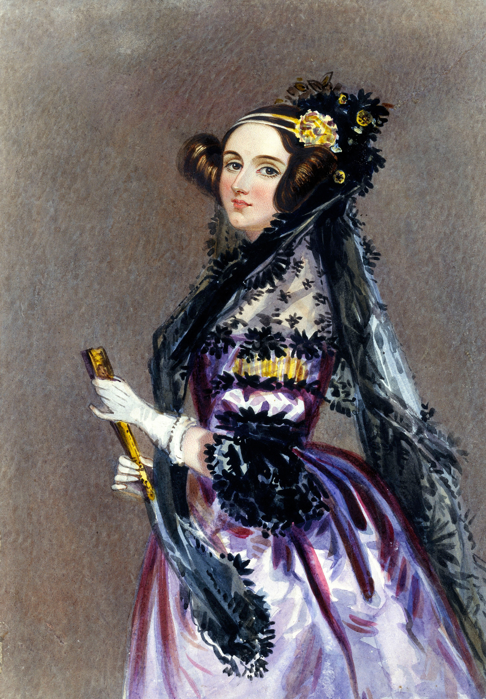 [Ada Lovelace](pioneers/ada-lovelace/) | 1815-1852 | First algorithm | Programming, Mathematics | Her insight that software can manipulate symbols foreshadows modern creative computing and AI. |
  | 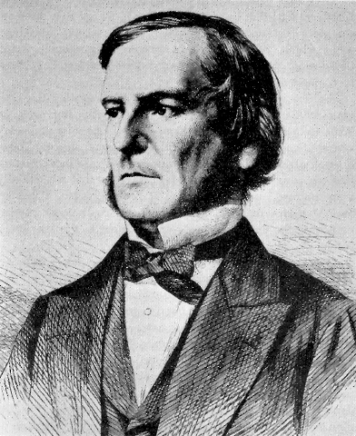 [George Boole](pioneers/george-boole/) | 1815-1864 | Boolean algebra | Mathematics, Logic | Boolean logic is baked into every CPU, database filter, and search query. |
  | 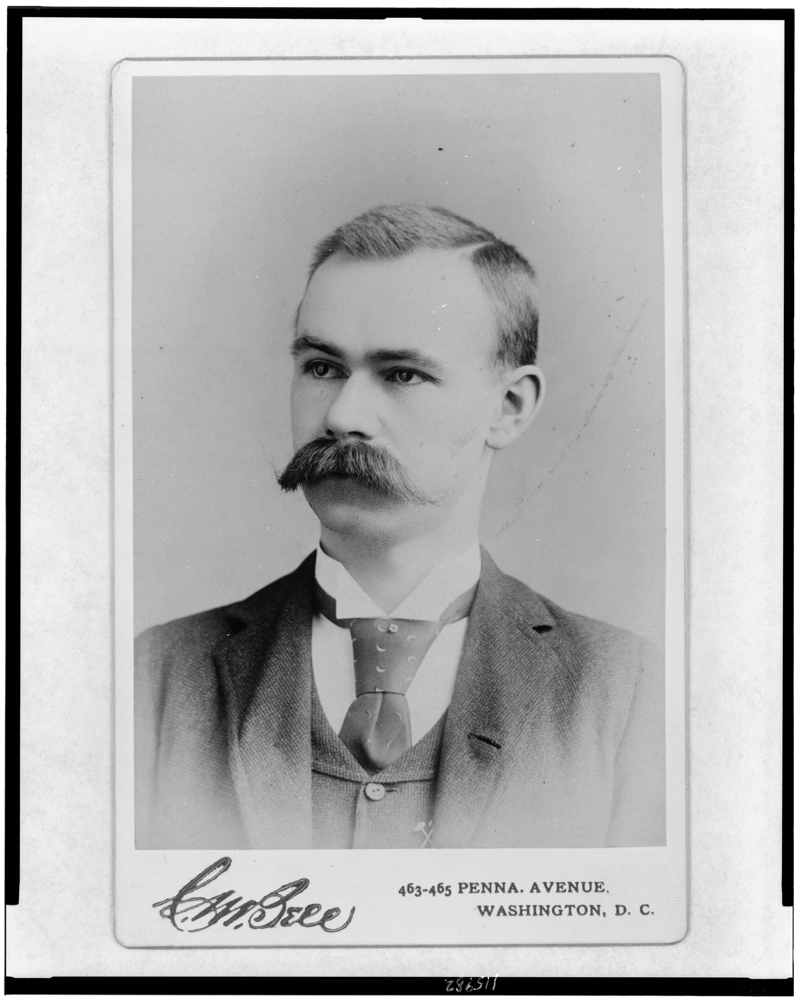 [Herman Hollerith](pioneers/herman-hollerith/) | 1860-1929 | Punch card tabulating machines | Data Processing | Large-scale data processing and business computing start with his tabulators. |
  | 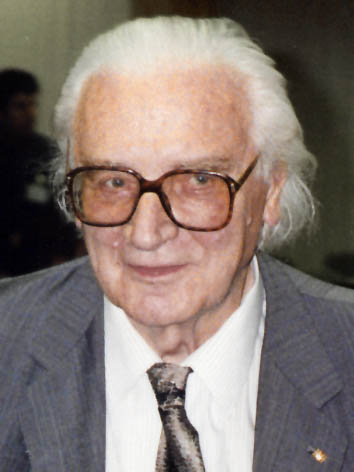 [Konrad Zuse](pioneers/konrad-zuse/) | 1910-1995 | Z3, first programmable computer | Computer Hardware | His Z3 and Plankalkül anticipate programmable machines and higher-level languages. |

  ### Foundational Computer Science (1950s-1970s)

  | Name | Lifespan | Key Contribution | Field | Why it matters today |
  | ---- | -------- | ---------------- | ----- | -------------------- |
  | 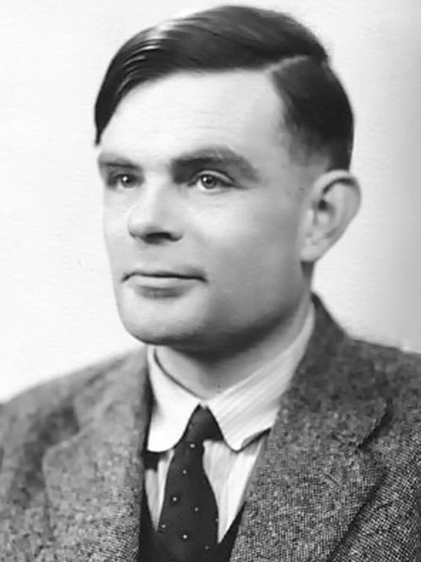 [Alan Turing](foundational-cs/alan-turing/) | 1912-1954 | Turing machine, computability | Theoretical CS, AI | Computability, codebreaking, and AI evaluation still orbit Turing's ideas. |
  | 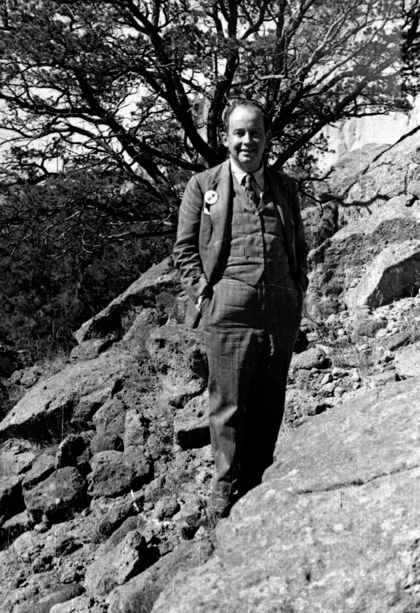 [John von Neumann](foundational-cs/john-von-neumann/) | 1903-1957 | Von Neumann architecture | Computer Architecture | Nearly every laptop, phone, and cloud server still follows his stored-program model. |
  | 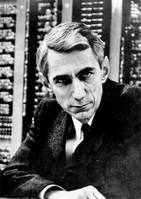 [Claude Shannon](foundational-cs/claude-shannon/) | 1916-2001 | Information theory | Information Theory | Compression, cryptography, and digital communication all sit on Shannon's theory. |
  | 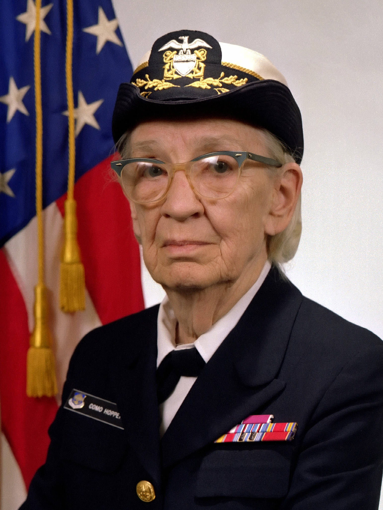 [Grace Hopper](foundational-cs/grace-hopper/) | 1906-1992 | First compilers, COBOL | Programming Languages | Compilers and readable languages remain central to developer productivity. |
  | 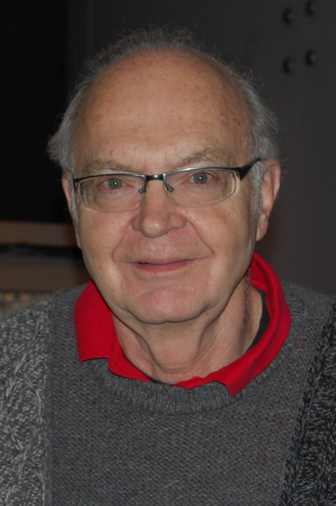 🏆 [Donald Knuth](foundational-cs/donald-knuth/) | b. 1938 | _TAOCP_, TeX | Algorithms, Typesetting | Algorithm analysis and TeX still shape software engineering and scientific publishing. |
  |  🏆 [Edsger Dijkstra](foundational-cs/edsger-dijkstra/) | 1930-2002 | Dijkstra's algorithm | Algorithms | Shortest-path routing powers maps, networks, and infrastructure software every day. |
  | 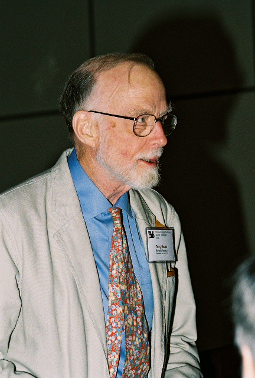 🏆 [Tony Hoare](foundational-cs/tony-hoare/) | b. 1934 | Quicksort, Hoare logic | Algorithms, Formal Methods | Quicksort and formal verification still underpin performant and reliable software. |

  ### Systems & Languages

  | Name | Lifespan | Key Contribution | Field | Why it matters today |
  | ---- | -------- | ---------------- | ----- | -------------------- |
  |  [John G. Kemeny](systems-languages/john-kemeny/) | 1926-1992 | BASIC, time-sharing | Programming Languages | Beginner-friendly programming and campus-wide access foreshadow coding education platforms. |
  |  [Thomas E. Kurtz](systems-languages/thomas-kurtz/) | b. 1928 | BASIC, time-sharing | Programming Languages | Shared computing for students prefigured modern cloud labs and edtech. |
  |  [Margaret Hamilton](systems-languages/margaret-hamilton/) | b. 1936 | Apollo software, "software engineering" | Software Engineering | Fault-tolerant software design remains essential in aerospace and safety-critical systems. |
  | 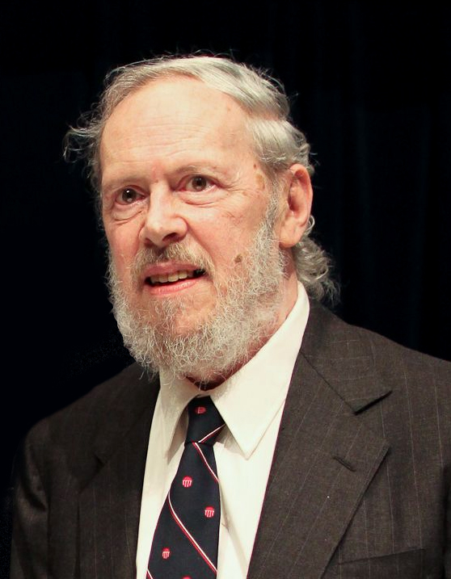 🏆 [Dennis Ritchie](systems-languages/dennis-ritchie/) | 1941-2011 | C language, Unix | Operating Systems | C and Unix still shape operating systems, compilers, and low-level tooling. |
  |  🏆 [Ken Thompson](systems-languages/ken-thompson/) | b. 1943 | Unix, C | Operating Systems | Unix, UTF-8, and Go influence everything from servers to modern developer workflows. |
  | 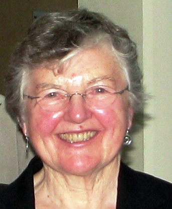 🏆 [Frances Allen](systems-languages/frances-allen/) | 1932-2020 | Compiler optimization | Compiler Theory | Compiler optimizations still unlock performance on CPUs, GPUs, and AI workloads. |
  |  🏆 [Barbara Liskov](systems-languages/barbara-liskov/) | b. 1939 | Data abstraction | Programming Languages | LSP and data abstraction still guide APIs, OOP, and distributed systems. |
  |  [Bjarne Stroustrup](systems-languages/bjarne-stroustrup/) | b. 1950 | C++ | Programming Languages | C++ still powers browsers, trading systems, game engines, and embedded devices. |
  | 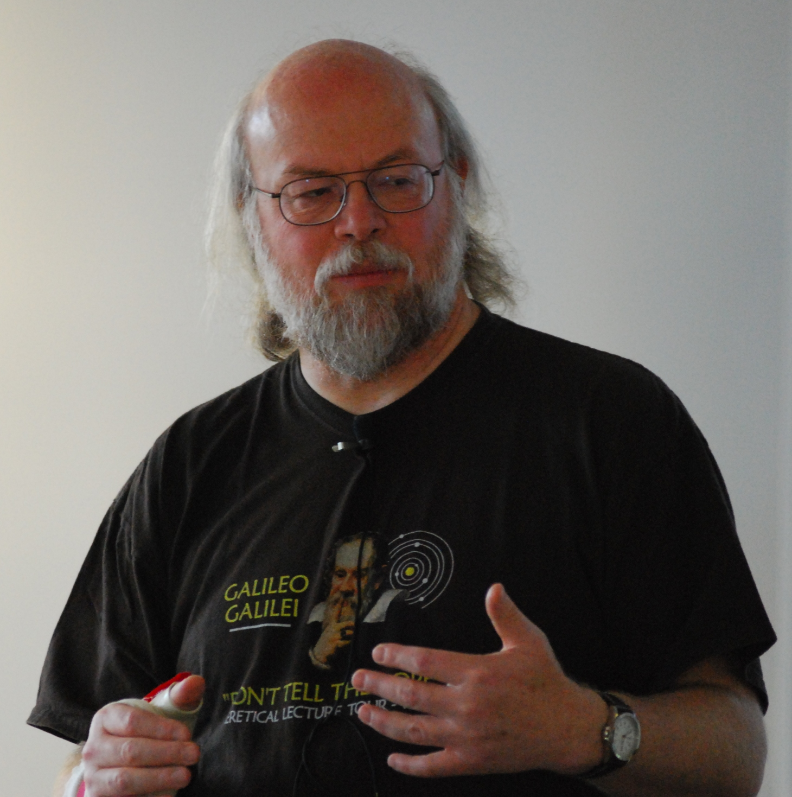 [James Gosling](systems-languages/james-gosling/) | b. 1955 | Java | Programming Languages | Java and the JVM remain core to enterprise systems, Android, and large-scale backends. |
  | 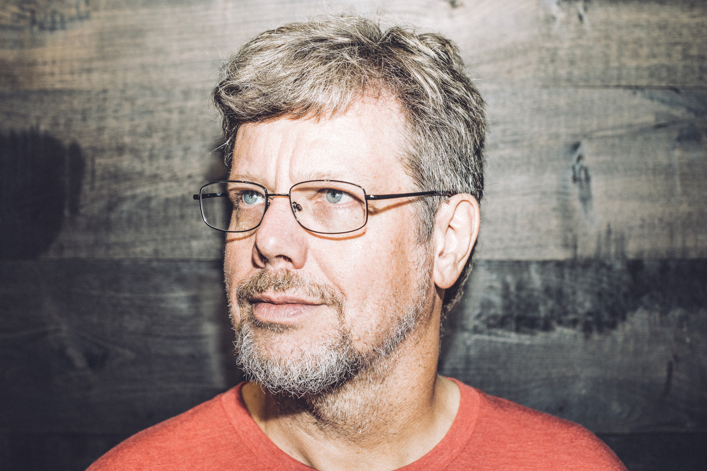 [Guido van Rossum](systems-languages/guido-van-rossum/) | b. 1956 | Python | Programming Languages | Python is the lingua franca of AI, automation, data science, and teaching. |
  |  [Brendan Eich](systems-languages/brendan-eich/) | b. 1961 | JavaScript | Web Technologies | JavaScript still runs the interactive web in every browser on Earth. |
  | 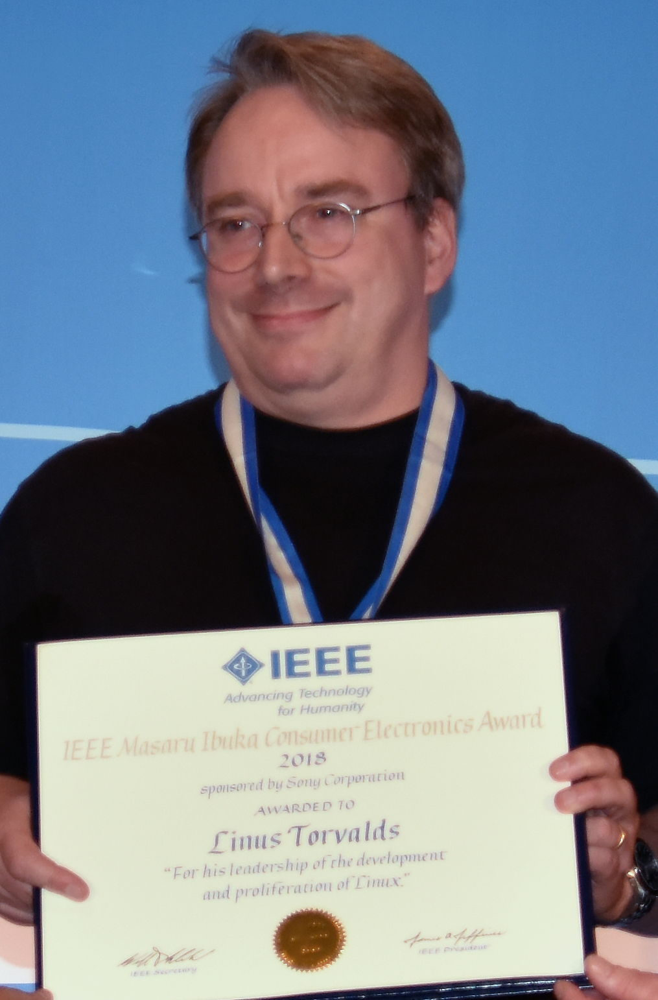 [Linus Torvalds](systems-languages/linus-torvalds/) | b. 1969 | Linux kernel, Git | Operating Systems | Linux and Git are foundational infrastructure for cloud, mobile, and open source. |

  ### AI Pioneers (1950s-1980s)

  | Name | Lifespan | Key Contribution | Field | Why it matters today |
  | ---- | -------- | ---------------- | ----- | -------------------- |
  | 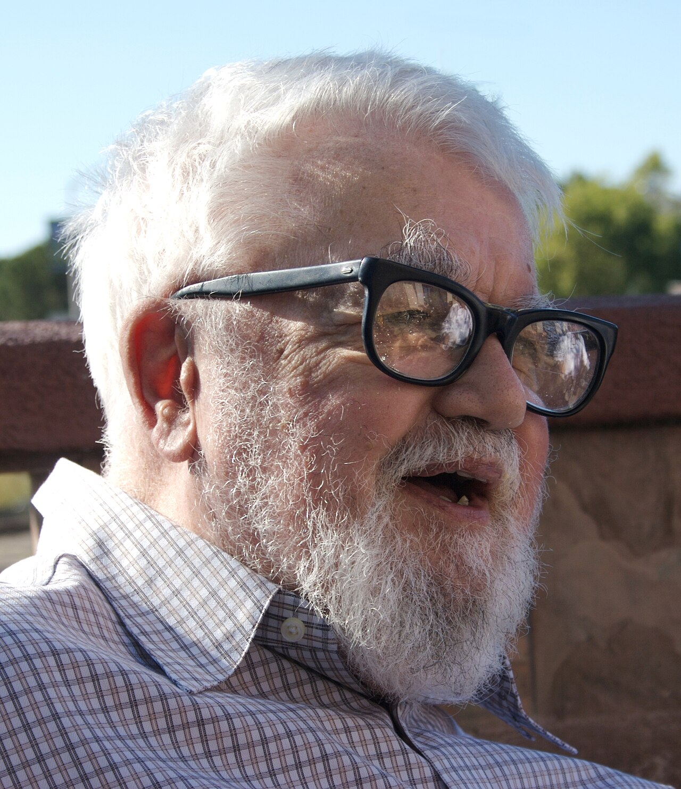 🏆 [John McCarthy](ai-pioneers/john-mccarthy/) | 1927-2011 | Coined "AI", Lisp | Artificial Intelligence | AI as a field, Lisp, and symbolic reasoning still shape research and tooling. |
  | 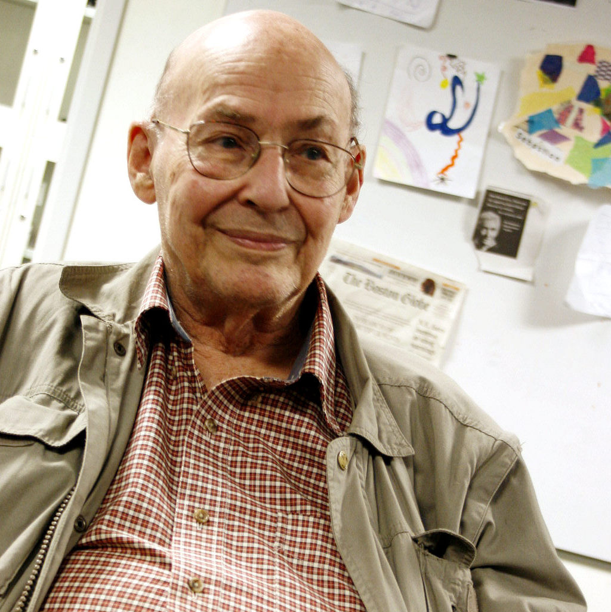 🏆 [Marvin Minsky](ai-pioneers/marvin-minsky/) | 1927-2016 | AI Lab, perceptrons | Artificial Intelligence | His ideas on minds, perception, and AI still influence robotics and AGI debates. |
  | 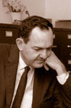 🏆 [Allen Newell](ai-pioneers/allen-newell/) | 1927-1992 | Logic Theorist | AI, Cognitive Psychology | Problem-solving architectures and human-computer modeling still inform AI system design. |
  | 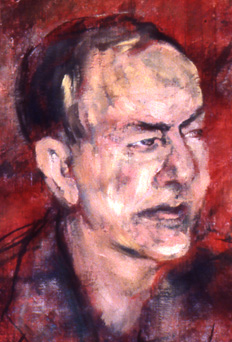 🏆 [Herbert Simon](ai-pioneers/herbert-simon/) | 1916-2001 | Logic Theorist | AI, Cognitive Psychology | Bounded rationality still shapes product design, behavioral science, and decision AI. |

  ### Modern AI & Machine Learning

  | Name | Lifespan | Key Contribution | Field | Why it matters today |
  | ---- | -------- | ---------------- | ----- | -------------------- |
  | 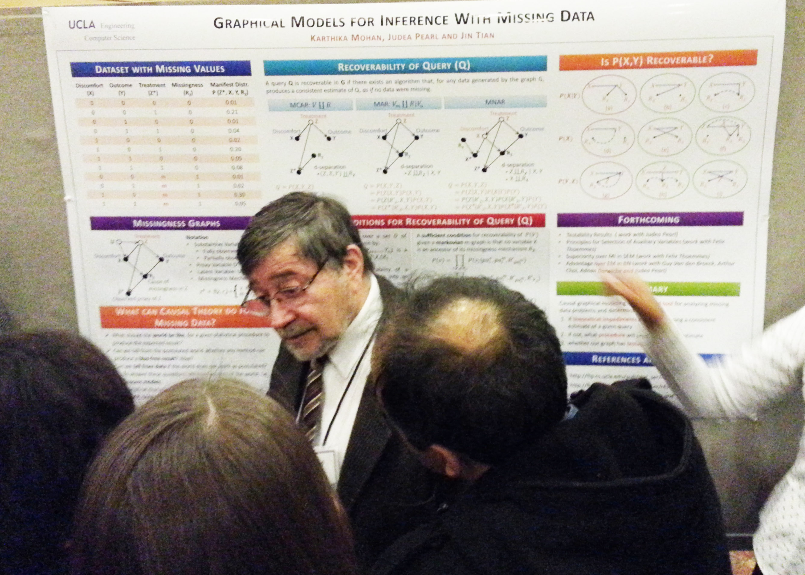 🏆 [Judea Pearl](modern-ai-ml/judea-pearl/) | b. 1936 | Bayesian networks, causality | AI, Probabilistic Reasoning | Causality and Bayesian reasoning are central to trustworthy, explainable AI. |
  | 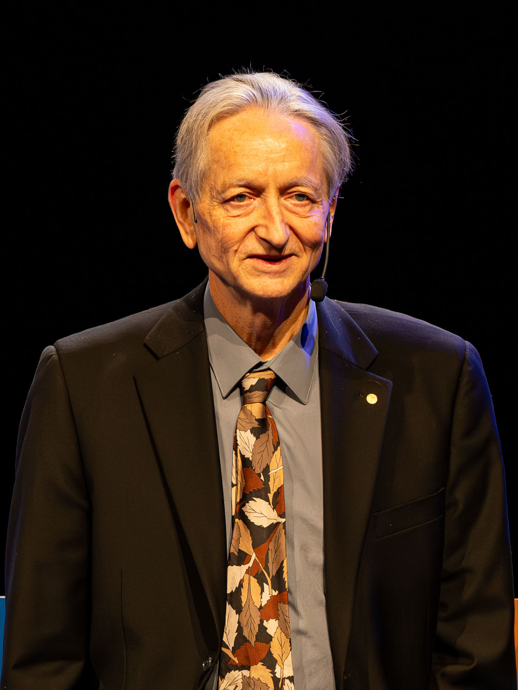 🏆 [Geoffrey Hinton](modern-ai-ml/geoffrey-hinton/) | b. 1947 | Backpropagation | Deep Learning | Deep learning breakthroughs now power speech, vision, and generative AI. |
  |  🏆 [Yann LeCun](modern-ai-ml/yann-lecun/) | b. 1960 | Convolutional neural networks | Computer Vision, Deep Learning | CNNs made modern computer vision practical, from phones to self-driving research. |
  |  🏆 [Yoshua Bengio](modern-ai-ml/yoshua-bengio/) | b. 1964 | Deep learning, sequences | Machine Learning | Representation learning and generative modeling drive today's AI progress. |
  | 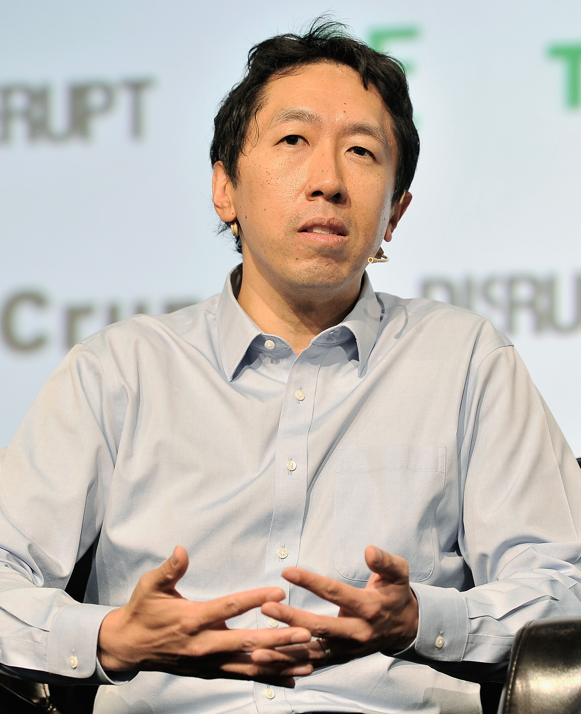 [Andrew Ng](modern-ai-ml/andrew-ng/) | b. 1976 | Google Brain, AI education | Machine Learning | He helped turn machine learning into a practical skill for millions of engineers. |

  ### Web & Internet

  | Name | Lifespan | Key Contribution | Field | Why it matters today |
  | ---- | -------- | ---------------- | ----- | -------------------- |
  | 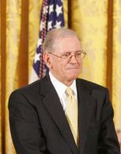 🏆 [Bob Kahn](web-internet/bob-kahn/) | b. 1938 | TCP/IP | Computer Networks | TCP/IP's open architecture lets billions of devices communicate across the internet. |
  | 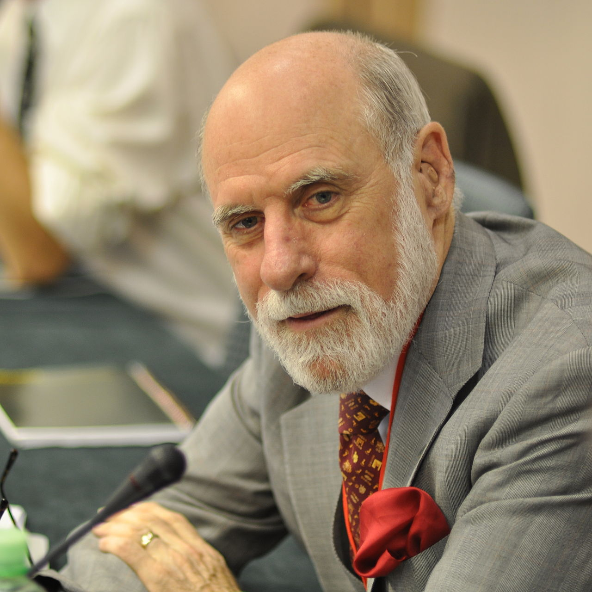 🏆 [Vint Cerf](web-internet/vint-cerf/) | b. 1943 | TCP/IP | Computer Networks | The internet still runs on the protocols he co-designed. |
  |  [Radia Perlman](web-internet/radia-perlman/) | b. 1951 | Spanning Tree Protocol | Computer Networks | Spanning Tree Protocol still keeps Ethernet networks loop-free and stable. |
  | 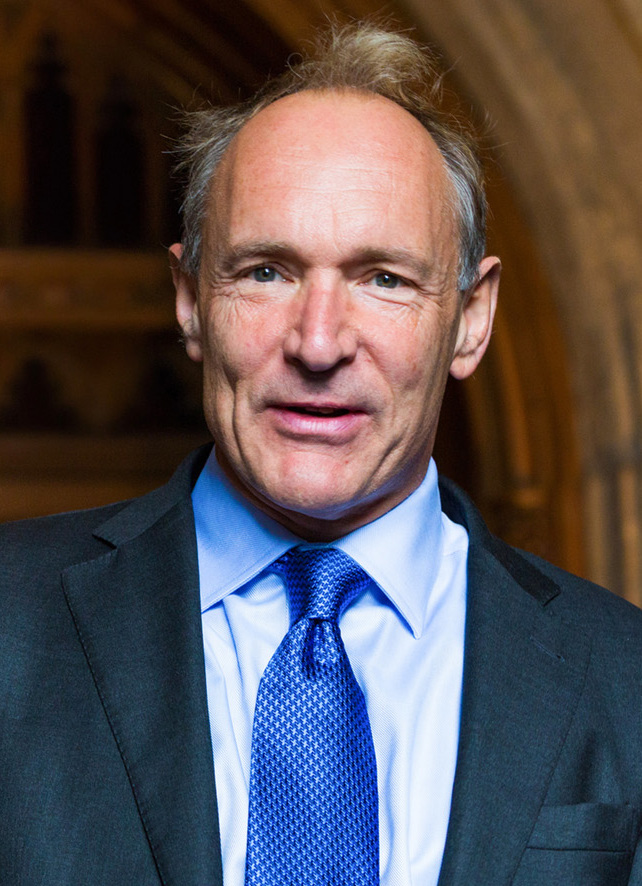 🏆 [Tim Berners-Lee](web-internet/tim-berners-lee/) | b. 1955 | World Wide Web | Web Technologies | Open web standards still keep the web interoperable, linkable, and universal. |

  ## Contributing

  Suggestions and improvements are welcome!

  - Open an issue or pull request
  - Keep entries factual and cite reputable sources when adding new claims
  - Prefer concise summaries of contributions and impact

  ## License

  Dual licensed under CC0-1.0 (public domain dedication) and MIT License. See `LICENSE` files for details.

  Portrait attributions for non-public-domain images are listed in [`PORTRAIT_CREDITS.md`](PORTRAIT_CREDITS.md).
      <td>Linux kernel, Git</td>
      <td>Operating Systems</td>
    </tr>
  </tbody>
</table>
=======
| Name | Lifespan | Key Contribution | Field | Why it matters today |
| ---- | -------- | ---------------- | ----- | -------------------- |
|  [Alan Turing](foundational-cs/alan-turing/) | 1912-1954 | Turing machine, computability | Theoretical CS, AI | Computability, codebreaking, and AI evaluation still orbit Turing's ideas. |
|  [John von Neumann](foundational-cs/john-von-neumann/) | 1903-1957 | Von Neumann architecture | Computer Architecture | Nearly every laptop, phone, and cloud server still follows his stored-program model. |
|  [Claude Shannon](foundational-cs/claude-shannon/) | 1916-2001 | Information theory | Information Theory | Compression, cryptography, and digital communication all sit on Shannon's theory. |
|  [Grace Hopper](foundational-cs/grace-hopper/) | 1906-1992 | First compilers, COBOL | Programming Languages | Compilers and readable languages remain central to developer productivity. |
|  🏆 [Donald Knuth](foundational-cs/donald-knuth/) | b. 1938 | _TAOCP_, TeX | Algorithms, Typesetting | Algorithm analysis and TeX still shape software engineering and scientific publishing. |
|  🏆 [Edsger Dijkstra](foundational-cs/edsger-dijkstra/) | 1930-2002 | Dijkstra's algorithm | Algorithms | Shortest-path routing powers maps, networks, and infrastructure software every day. |
|  🏆 [Tony Hoare](foundational-cs/tony-hoare/) | b. 1934 | Quicksort, Hoare logic | Algorithms, Formal Methods | Quicksort and formal verification still underpin performant and reliable software. |

### Systems & Languages

| Name | Lifespan | Key Contribution | Field | Why it matters today |
| ---- | -------- | ---------------- | ----- | -------------------- |
|  [John G. Kemeny](systems-languages/john-kemeny/) | 1926-1992 | BASIC, time-sharing | Programming Languages | Beginner-friendly programming and campus-wide access foreshadow coding education platforms. |
|  [Thomas E. Kurtz](systems-languages/thomas-kurtz/) | b. 1928 | BASIC, time-sharing | Programming Languages | Shared computing for students prefigured modern cloud labs and edtech. |
|  [Margaret Hamilton](systems-languages/margaret-hamilton/) | b. 1936 | Apollo software, "software engineering" | Software Engineering | Fault-tolerant software design remains essential in aerospace and safety-critical systems. |
|  🏆 [Dennis Ritchie](systems-languages/dennis-ritchie/) | 1941-2011 | C language, Unix | Operating Systems | C and Unix still shape operating systems, compilers, and low-level tooling. |
|  🏆 [Ken Thompson](systems-languages/ken-thompson/) | b. 1943 | Unix, C | Operating Systems | Unix, UTF-8, and Go influence everything from servers to modern developer workflows. |
|  🏆 [Frances Allen](systems-languages/frances-allen/) | 1932-2020 | Compiler optimization | Compiler Theory | Compiler optimizations still unlock performance on CPUs, GPUs, and AI workloads. |
|  🏆 [Barbara Liskov](systems-languages/barbara-liskov/) | b. 1939 | Data abstraction | Programming Languages | LSP and data abstraction still guide APIs, OOP, and distributed systems. |
|  [Bjarne Stroustrup](systems-languages/bjarne-stroustrup/) | b. 1950 | C++ | Programming Languages | C++ still powers browsers, trading systems, game engines, and embedded devices. |
|  [James Gosling](systems-languages/james-gosling/) | b. 1955 | Java | Programming Languages | Java and the JVM remain core to enterprise systems, Android, and large-scale backends. |
|  [Guido van Rossum](systems-languages/guido-van-rossum/) | b. 1956 | Python | Programming Languages | Python is the lingua franca of AI, automation, data science, and teaching. |
|  [Brendan Eich](systems-languages/brendan-eich/) | b. 1961 | JavaScript | Web Technologies | JavaScript still runs the interactive web in every browser on Earth. |
|  [Linus Torvalds](systems-languages/linus-torvalds/) | b. 1969 | Linux kernel, Git | Operating Systems | Linux and Git are foundational infrastructure for cloud, mobile, and open source. |
>>>>>>> 00ac0b2 (Improve README discovery and profile layout)

### AI Pioneers (1950s–1980s)

<<<<<<< HEAD
<table width="100%">
  <thead>
    <tr>
      <th width="25%">Name</th>
      <th width="25%">Lifespan</th>
      <th width="25%">Key Contribution</th>
      <th width="25%">Field</th>
    </tr>
  </thead>
  <tbody>
    <tr>
      <td><a href="ai-pioneers/john-mccarthy/">John McCarthy</a></td>
      <td>1927–2011</td>
      <td>Coined "AI", Lisp</td>
      <td>Artificial Intelligence</td>
    </tr>
    <tr>
      <td><a href="ai-pioneers/marvin-minsky/">Marvin Minsky</a></td>
      <td>1927–2016</td>
      <td>AI Lab, perceptrons</td>
      <td>Artificial Intelligence</td>
    </tr>
    <tr>
      <td><a href="ai-pioneers/allen-newell/">Allen Newell</a></td>
      <td>1927–1992</td>
      <td>Logic Theorist</td>
      <td>AI, Cognitive Psychology</td>
    </tr>
    <tr>
      <td><a href="ai-pioneers/herbert-simon/">Herbert Simon</a></td>
      <td>1916–2001</td>
      <td>Logic Theorist</td>
      <td>AI, Cognitive Psychology</td>
    </tr>
  </tbody>
</table>

### Modern AI & Machine Learning

<table width="100%">
  <thead>
    <tr>
      <th width="25%">Name</th>
      <th width="25%">Lifespan</th>
      <th width="25%">Key Contribution</th>
      <th width="25%">Field</th>
    </tr>
  </thead>
  <tbody>
    <tr>
      <td><a href="modern-ai-ml/judea-pearl/">Judea Pearl</a></td>
      <td>b. 1936</td>
      <td>Bayesian networks, causality</td>
      <td>AI, Probabilistic Reasoning</td>
    </tr>
    <tr>
      <td><a href="modern-ai-ml/geoffrey-hinton/">Geoffrey Hinton</a></td>
      <td>b. 1947</td>
      <td>Backpropagation</td>
      <td>Deep Learning</td>
    </tr>
    <tr>
      <td><a href="modern-ai-ml/yann-lecun/">Yann LeCun</a></td>
      <td>b. 1960</td>
      <td>Convolutional neural networks</td>
      <td>Computer Vision, Deep Learning</td>
    </tr>
    <tr>
      <td><a href="modern-ai-ml/yoshua-bengio/">Yoshua Bengio</a></td>
      <td>b. 1964</td>
      <td>Deep learning, sequences</td>
      <td>Machine Learning</td>
    </tr>
    <tr>
      <td><a href="modern-ai-ml/andrew-ng/">Andrew Ng</a></td>
      <td>b. 1976</td>
      <td>Google Brain, AI education</td>
      <td>Machine Learning</td>
    </tr>
  </tbody>
</table>

### Web & Internet

<table width="100%">
  <thead>
    <tr>
      <th width="25%">Name</th>
      <th width="25%">Lifespan</th>
      <th width="25%">Key Contribution</th>
      <th width="25%">Field</th>
    </tr>
  </thead>
  <tbody>
    <tr>
      <td><a href="web-internet/bob-kahn/">Bob Kahn</a></td>
      <td>b. 1938</td>
      <td>TCP/IP</td>
      <td>Computer Networks</td>
    </tr>
    <tr>
      <td><a href="web-internet/vint-cerf/">Vint Cerf</a></td>
      <td>b. 1943</td>
      <td>TCP/IP</td>
      <td>Computer Networks</td>
    </tr>
    <tr>
      <td><a href="web-internet/radia-perlman/">Radia Perlman</a></td>
      <td>b. 1951</td>
      <td>Spanning Tree Protocol</td>
      <td>Computer Networks</td>
    </tr>
    <tr>
      <td><a href="web-internet/tim-berners-lee/">Tim Berners-Lee</a></td>
      <td>b. 1955</td>
      <td>World Wide Web</td>
      <td>Web Technologies</td>
    </tr>
  </tbody>
</table>
=======
| Name | Lifespan | Key Contribution | Field | Why it matters today |
| ---- | -------- | ---------------- | ----- | -------------------- |
|  🏆 [John McCarthy](ai-pioneers/john-mccarthy/) | 1927-2011 | Coined "AI", Lisp | Artificial Intelligence | AI as a field, Lisp, and symbolic reasoning still shape research and tooling. |
|  🏆 [Marvin Minsky](ai-pioneers/marvin-minsky/) | 1927-2016 | AI Lab, perceptrons | Artificial Intelligence | His ideas on minds, perception, and AI still influence robotics and AGI debates. |
|  🏆 [Allen Newell](ai-pioneers/allen-newell/) | 1927-1992 | Logic Theorist | AI, Cognitive Psychology | Problem-solving architectures and human-computer modeling still inform AI system design. |
|  🏆 [Herbert Simon](ai-pioneers/herbert-simon/) | 1916-2001 | Logic Theorist | AI, Cognitive Psychology | Bounded rationality still shapes product design, behavioral science, and decision AI. |

### Modern AI & Machine Learning

| Name | Lifespan | Key Contribution | Field | Why it matters today |
| ---- | -------- | ---------------- | ----- | -------------------- |
|  🏆 [Judea Pearl](modern-ai-ml/judea-pearl/) | b. 1936 | Bayesian networks, causality | AI, Probabilistic Reasoning | Causality and Bayesian reasoning are central to trustworthy, explainable AI. |
|  🏆 [Geoffrey Hinton](modern-ai-ml/geoffrey-hinton/) | b. 1947 | Backpropagation | Deep Learning | Deep learning breakthroughs now power speech, vision, and generative AI. |
|  🏆 [Yann LeCun](modern-ai-ml/yann-lecun/) | b. 1960 | Convolutional neural networks | Computer Vision, Deep Learning | CNNs made modern computer vision practical, from phones to self-driving research. |
|  🏆 [Yoshua Bengio](modern-ai-ml/yoshua-bengio/) | b. 1964 | Deep learning, sequences | Machine Learning | Representation learning and generative modeling drive today's AI progress. |
|  [Andrew Ng](modern-ai-ml/andrew-ng/) | b. 1976 | Google Brain, AI education | Machine Learning | He helped turn machine learning into a practical skill for millions of engineers. |

### Web & Internet

| Name | Lifespan | Key Contribution | Field | Why it matters today |
| ---- | -------- | ---------------- | ----- | -------------------- |
|  🏆 [Bob Kahn](web-internet/bob-kahn/) | b. 1938 | TCP/IP | Computer Networks | TCP/IP's open architecture lets billions of devices communicate across the internet. |
|  🏆 [Vint Cerf](web-internet/vint-cerf/) | b. 1943 | TCP/IP | Computer Networks | The internet still runs on the protocols he co-designed. |
|  [Radia Perlman](web-internet/radia-perlman/) | b. 1951 | Spanning Tree Protocol | Computer Networks | Spanning Tree Protocol still keeps Ethernet networks loop-free and stable. |
|  🏆 [Tim Berners-Lee](web-internet/tim-berners-lee/) | b. 1955 | World Wide Web | Web Technologies | Open web standards still keep the web interoperable, linkable, and universal. |
>>>>>>> 00ac0b2 (Improve README discovery and profile layout)

## Contributing

Suggestions and improvements are welcome!

- Open an issue or pull request
- Keep entries factual and cite reputable sources when adding new claims
- Prefer concise summaries of contributions and impact

## License

Dual licensed under CC0-1.0 (public domain dedication) and MIT License. See `LICENSE` files for details.

Portrait attributions for non-public-domain images are listed in [`PORTRAIT_CREDITS.md`](PORTRAIT_CREDITS.md).
