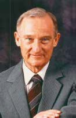

# Seymour Cray

*Seymour Cray treated speed as a design philosophy, not just a benchmark. He did not merely build faster computers; he repeatedly redefined what the fastest computer in the world could be.*

**Field:** Supercomputing, Computer Architecture, High-Performance Systems

- **Lifespan:** 1925–1996
- **Key contribution:** Designed the CDC 6600, Cray-1, and other landmark supercomputers
- **Impact:** Created the supercomputer industry and set the standard for high-performance system design for decades

 

## Biography

### Early Life & Education
Seymour Roger Cray was born on September 28, 1925, in Chippewa Falls, Wisconsin. He showed technical curiosity early, building devices as a child and turning part of his family's basement into a workshop.

World War II interrupted his education. Cray served as a radio operator and later worked on codebreaking in the Pacific theater. After the war, he studied electrical engineering at the University of Minnesota, where he earned degrees that prepared him for a career in advanced machine design.

### Career
Cray began professional computing work at **Engineering Research Associates (ERA)** in 1950. There he helped design the **ERA 1103**, one of the early important scientific computers. After the organizational changes that took ERA through Remington Rand and Sperry, Cray and William Norris helped found **Control Data Corporation (CDC)** in 1957.

At CDC, Cray designed the **CDC 1604**, but his greatest early triumph was the **CDC 6600**, introduced in 1964. It is widely regarded as the first commercially successful supercomputer. Cray understood that raw processor speed alone was not enough; memory, I/O, cooling, layout, and system balance all mattered. That holistic approach became his signature.

He followed the 6600 with the **CDC 7600**, then later left CDC and founded **Cray Research**. There he produced the iconic **Cray-1**, one of the most recognizable and successful supercomputers ever made. Later systems such as the Cray-2 and Cray-3 were more uneven commercially, but even the difficult projects revealed his willingness to push technology to the limit.

### Later Life & Legacy
Cray spent his career in pursuit of the next big leap in performance. He remained skeptical of trends he thought compromised elegance, including some forms of massively parallel computing, though he later began exploring those ideas more directly.

He died on October 5, 1996, after a car accident. By then he had already become known as the **father of supercomputing** and the **Wizard of Chippewa Falls**. His machines were not just faster than their competitors; they changed how engineers thought about high-performance design itself.

## Major Contributions

### CDC 6600 (1964)
- **Year:** 1964
- **Context:** Scientific computing required performance far beyond what mainstream commercial machines could offer
- **Technical Details:** Combined a powerful central processor with peripheral processors that handled input and output, reducing bottlenecks and improving total system throughput
- **Impact:** Widely considered the first successful supercomputer and a turning point in high-performance computing

### CDC 7600 (1969)
- **Year:** 1969
- **Context:** After the 6600, Cray pursued an even more aggressive performance leap
- **Technical Details:** Extended his system-level design philosophy with faster circuitry, tighter signal timing, and deeper attention to physical layout
- **Impact:** Reinforced Cray's reputation as the world's premier designer of ultra-fast computers

### Cray-1 (1976)
- **Year:** 1976
- **Context:** After leaving CDC, Cray needed to prove he could build another category-defining machine from a new company
- **Technical Details:** Famous for vector processing, compact C-shaped design, careful cooling, and an emphasis on minimizing signal delays
- **Impact:** Became the iconic supercomputer of its era and helped establish Cray Research as the dominant name in the field

## Publications & Works

- Designs associated with the ERA 1103, CDC 1604, CDC 6600, CDC 7600, and Cray-1
- Later work on the Cray-2, Cray-3, and Cray-4 projects
- Public lectures and interviews on high-performance system design and gallium arsenide computing

## Awards & Honors

| Year | Award |
|------|-------|
| 1987 | IEEE Emanuel R. Piore Award |
| 1997 | IEEE Computer Society Seymour Cray Computer Engineering Award established in his honor |
| Various | Long-standing recognition as "father of supercomputing" |

## Quotes

> "Anyone can build a fast CPU. The trick is to build a fast system."

> "If you were plowing a field, which would you rather use: two strong oxen or 1024 chickens?"

## Influence & Legacy

### Direct Influence
Cray's machines shaped weather modeling, weapons simulation, scientific research, and large-scale numerical computation. He set the technical and cultural standard for supercomputing.

### Indirect Influence
His obsessive concern for cooling, signal timing, packaging, and total system balance influenced generations of architects working far beyond the supercomputer niche.

### Modern Relevance
Today's HPC systems use very different component technologies, but the central design lesson remains pure Cray: performance is a whole-system problem.

## Related Figures

- [Gordon Bell](../gordon-bell/) — another major computer architect who shaped the structure of modern computing systems
- [John von Neumann](../../foundational-cs/john-von-neumann/) — earlier architectural pioneer for stored-program machines
- [John Atanasoff](../../pioneers/john-atanasoff/) — part of the earlier hardware lineage that made digital computing possible

## Resources

- [Computer History Museum materials on Seymour Cray](https://computerhistory.org/)
- [IEEE profile and award materials](https://www.computer.org/)
- Murray, Charles J. *The Supermen* (major biography)

## Timeline

| Year | Event |
|------|-------|
| 1925 | Born in Chippewa Falls, Wisconsin |
| 1950 | Joins Engineering Research Associates |
| 1953 | Associated with ERA 1103 work |
| 1957 | Helps found Control Data Corporation |
| 1960 | CDC 1604 introduced |
| 1964 | CDC 6600 unveiled |
| 1969 | CDC 7600 arrives |
| 1972 | Leaves CDC |
| 1972 | Founds Cray Research |
| 1976 | Cray-1 released |
| 1993 | Cray-3 delivered in prototype form |
| 1996 | Dies after car accident |

## References

1. Murray, Charles J. *The Supermen*. John Wiley & Sons, 1997.
2. Computer History Museum oral histories and profile materials.
3. IEEE Computer Society biographical materials on Seymour Cray.
4. Contemporary historical accounts of CDC and Cray Research systems.

## Navigation

- [← Main Index](../../README.md)
- [← Previous: Steve Wozniak](../steve-wozniak/)
- [↑ Category Overview](../README.md)
- [Next: Gordon Bell →](../gordon-bell/)

---

**Last Updated:** 2026-04-16
